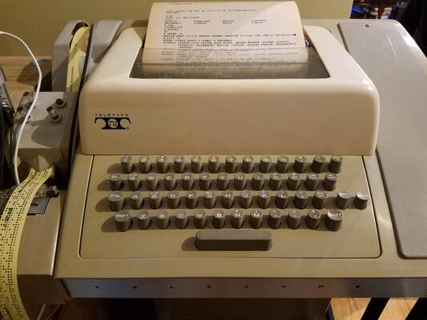

# Teletype Model 33 ASR

* Some Background:
    * History: [ASCII, Unix and the ASR33](doc/01-history.md) 
    * So, what exactly is a [Teletype terminal?](doc/02-teletype.md)
    * [About This Project](doc/03-project.md)

* Getting Connected:
    * [Hardware](hardware/README.md): electronics to operate the 20mA current-loop. 
    * [Firmware](firmware/README.md): using a Teensy microcontroller for a modern USB connection.
    * Connecting to [MacOS](osx/README.md) and to a [Raspberry Pi](rpi/README.md) (with some `getty` and `terminfo` Unix archaeology)
    * Using [CUPS](https://en.wikipedia.org/wiki/CUPS) to make the Teletype appear as a network printer.

* Making It Useful:
    * [Applications](bin/README.md) including command-line utilities for the tty user.  Includes scripts to print [words on papertape](https://twitter.com/33asr/status/1074432596728262656), connect to [LambdaMoo](https://twitter.com/33asr/status/1078698114003943425), print [emoji](https://twitter.com/33asr/status/1046930898321645568), play [zork](https://github.com/hughpyle/ASR33/blob/master/bin/profile), run [state-of-the art language AI](https://github.com/hughpyle/ASR33/blob/master/gpt2/README.md), connect to [bbs](https://github.com/hughpyle/ASR33/blob/master/bin/_bbs) and [old mainframes](https://github.com/hughpyle/ASR33/blob/master/bin/_cdc), and more.
    * [ASCII Art](asciiart/README.md) using the unique features of an antique hard-copy terminal, including _overstrike_.
    * [Paper Tape Art](bin/patterns/README.md) too.

* [Photos](pix/)

 
Follow along – and dive in please! – [here on GitHub](https://github.com/hughpyle/ASR33), and [@33asr on Twitter](https://twitter.com/33asr).  And check out [my Etsy store](https://www.etsy.com/shop/asr33)!

---

The contents of this project are published under the [MIT license](LICENSE), let me know what you do with it!
