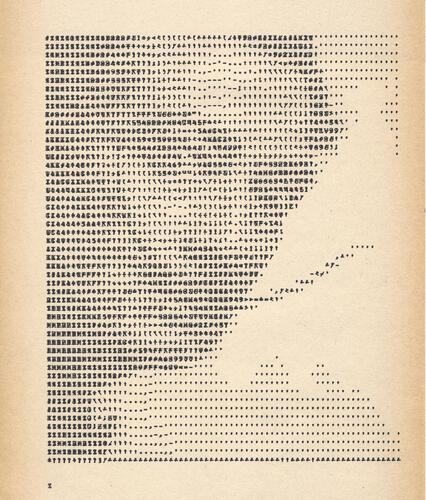
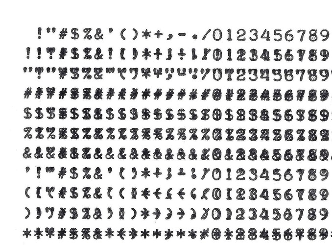
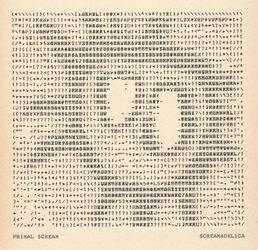
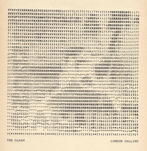
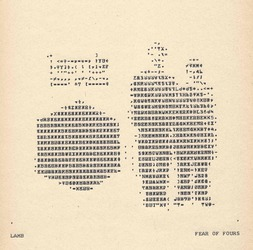
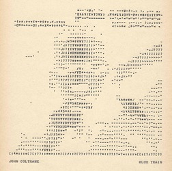
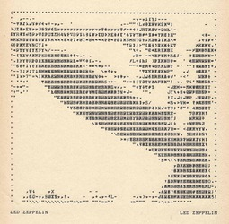
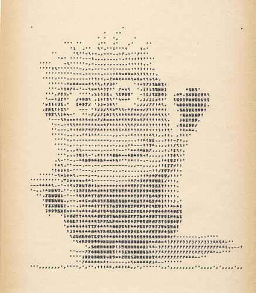

# ASCII Art

[](dali.txt.jpg)  

I've been experimenting with various ways to print graphics on the Teletype.  

Teletype printed art is more constrained than ANSI- or ASCII-Art on modern machines, since there's no color, no block-graphic or line-graphic characters, no lowercase, and quite a limited set of punctuation (missing the underscore, vertical-bar, curly braces, etc.)  On the other hand, as a hardcopy printer, we can overtype multiple characters at the same location.


These experiments cover a few ways to convert a graphic image into a text image:

* Convert the source image to grayscale, then match each part of the image to the **luminance** of a printed character.  For example, a sorted list of the Teletype characters by printed weight (e.g. `'.-,/^_\)+><(!";=1:?][J7I*YLT35CV49FO6D#AZUGS02$%P&WXEQH8B@KRNM`) can be mapped onto grayscale image luminance.  The weights of the printed characters don't make a linear luminance scale, so it can be better to use just a subset of the available characters (e.g. ` '-/<JIY3OPHKM`).  
* Add **overstrike**.  The teletype can print a line of text, then CR, then overprint, and this can be repeated several times to put a lot of ink on the paper.  Of course there are gaps in the final print even with heavy overstrike, because it's not possible to print between the lines or between the characters.
* Divide each printed character, and each region of the image, into several **sub-character pixels** so that (for example) `,` or `'` would be selected differently even if they had the same printed weight.  This can produce noticeably more realistic images for the same amount of printing.
* Analyze the **orientation** of lines in the image and the printed character.  For example, ` / ` and ` \ ` would be selected to match the orientation of edges in the image.  Again this can help to produce clearer prints of complex images.   

Here's some Python code that includes all of these aspects, and provides quite high-resolution rendering.

Without orientation-based matching, you can achieve similar results with a simpler approach (and faster runtime).  But I wanted to learn some numpy and skimage, and the results are fun!
  
Printing is slow and noisy.  A full-page image is around 8KB and can take up to 15 minutes to print.


## Preparation

First I printed out and scanned a table of all the two-character overstrike combinations.  The first column, and the first row, are overstrike with space, i.e. single-strike characters.  The table is symmetrical about the diagonal, but that doesn't matter for the processing.
```
python image2.py --table
```  
[](chars_overstrike.jpg)

Then, [some code](prep_overstrike.py) reads this image, pulls out each character-sized box, and analyzes it using a [Histogram of Oriented Gradients](http://scikit-image.org/docs/dev/auto_examples/features_detection/plot_hog.html) (HOG).  Actually, each character box is subdivided into 3x4 squares, and the HOG is calculated for each "pixel".  The results are saved in a [data file](chars_overstrike.json).

Small distortions in the print and scan result in some misalignments to the rectangular block for each character.  Future work would improve the way that each printed character is found in the scanned table. 
```
python prep_overstrike.py
```

[](album_covers/album_debut.txt.jpg)
[](album_covers/album_screamadelica.txt.jpg)
[](album_covers/album_clash.txt.jpg)
[](album_covers/album_fours.txt.jpg)
[](album_covers/album_bluetrain.txt.jpg)
[](album_covers/album_ledzep.txt.jpg)


## Processing a picture

The [code to process a picture](image2.py) first resizes to a multiple of 198 pixels (66 characters print width by default, and 3 "sub-character pixels" per character), then analyzes each block using the HOG algorithm.

Then, each block in the image's HOG is matched to the blocks in the data.  The best match is the character that's not too dark, and that has the best correlation between the pair of histograms.

This gives us the best-matching overstrike character pair.  Finally, the results are collected into two lines of text for each row of the result.  The first line is printed, then a CR (carriage return) without a linefeed, then the second line, then CR+LF.

```
$ python image2.py --help
Usage: image2.py [OPTIONS] FILENAME

Options:
  --width INTEGER   Image width (characters)
  --invert          Invert colors
  --gamma FLOAT     Gamma correction
  --indent INTEGER  Indent with spaces
  --help            Show this message and exit.
```

For complex images, you may need to experiment with contrast and gamma correction for best results.

[](minion.txt.jpg)  

 
## Other resources

I haven't found other "sub-character-matching" ASCII art and tools, but I expect there are some.  Also I didn't come across any previous "orientation-matching" approaches.  References welcome!

There's a large selection of historical text art on [textfiles.com](http://www.textfiles.com/art/).  Some of this is drafted by hand, and some with the help of a computer.  In the RTTY collection (images sent over radio-teletype) and the DECUS collection (images from the minicomputer scene) you'll find several that use overstrike, including the famous [Mona Lisa](http://textfiles.com/art/DECUS/mona_lisa_2.txt).  Some of these are for 132-column lineprinters, and some for narrower devices.

`jp2a` ([https://csl.name/jp2a/](https://csl.name/jp2a/)) is a fast tool for converting images to text.  It supports ANSI color effects and HTML output, and is quite good for plaintext.  As far as I can tell it doesn't do overstrike.

To print lettering, use `figlet` ([http://www.figlet.org/](http://www.figlet.org/)).  It has a vast collection of fonts, although many of them rely on the underscore, which isn't present on the Teletype printwheel.

You can buy prints on [my Etsy store](https://www.etsy.com/shop/asr33).

