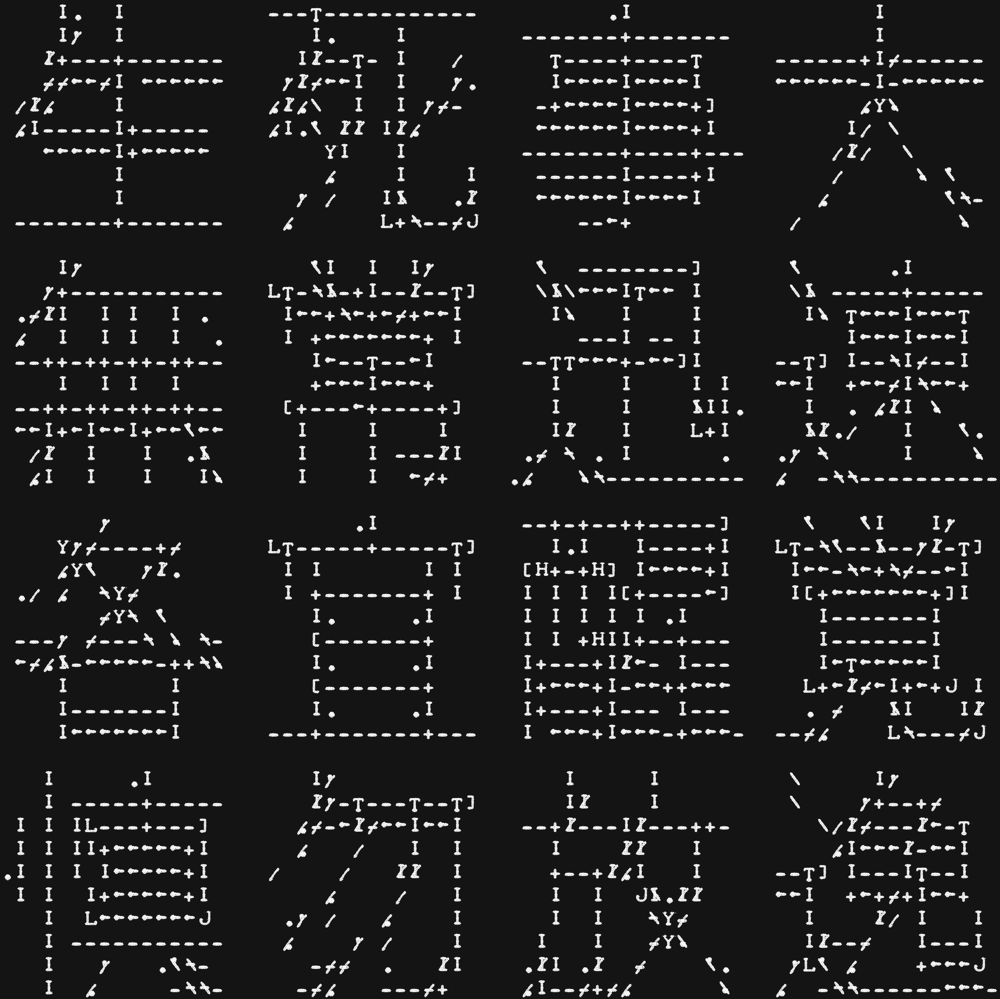

# Han Board (漢板) — Kanji for Teletype

Overstrike ASCII art rendering of the Zen Han board text, for printing on an ASR33 Teletype Model 33.

```
生死事大       sei shi ji dai       — life, death, things, great
無常迅速       mu jou jin soku      — impermanence, swiftly
各宜醒覚       kaku gi sei kaku     — each should awaken
慎勿放逸       shin motsu hou itsu  — be careful, do not be idle
```

[](han_board.txt)


## Rendering pipeline

The characters are rendered from TrueType font glyphs (IPA Gothic W3) using morphological stroke detection, not image matching.  The pipeline:

1. **Font rendering with pre-stretch** — Each kanji is rendered at native square proportions, then horizontally stretched by the Teletype aspect ratio (10 cpi / 6 lpi = 1.67x).  The Teletype's narrow character cells compress the print back to visually square on paper.

2. **Morphological opening** — Four directional structuring elements (horizontal, vertical, and two diagonals) detect stroke directions via binary opening.  The horizontal SE is aspect-scaled to avoid false detections on thick pre-stretched verticals.

3. **Multi-pass suppression** — Dominance suppression (density-adaptive: 40% threshold in dense cells, 50% in sparse), false orthogonal suppression, isolated stroke removal, and double-width thinning clean up the detection maps.

4. **Junction-aware character selection** — Edge connectivity and neighbor context select the best single character from the ASR33 printwheel.  Characters with built-in junctions (T, L, J, 7, [, ], H, Y) replace overstrike wherever possible.  Calligraphic overstrike pairs (`\` + `'` for entry terminals, `\` + `.` for exits, `\` + `-` for shallow angles) add brush-stroke texture.

5. **Scan-based preview** — The preview image composites scanned character cells from the actual ASR33 print ([chars_overstrike.jpg](../code/chars_overstrike.jpg)), giving an accurate simulation of the physical output.


## Character set

The ASR33 prints ASCII-1963 (codes 0x20-0x5F), 64 characters.  Key differences from modern ASCII: `^` is up-arrow, `_` is left-arrow.  No lowercase.

Single characters are preferred over overstrike for print quality.  The rendering uses structural characters:

| Character | Visual role |
|-----------|------------|
| `-` | horizontal stroke |
| `I` | vertical stroke |
| `/` `\` | diagonal strokes |
| `+` | crossing |
| `T` | horizontal top + vertical down |
| `L` | corner: vertical + horizontal right |
| `J` | vertical + hook left |
| `7` | horizontal + diagonal down-right |
| `[` `]` | vertical + horizontal (bracket edges) |
| `H` | double vertical bridged by horizontal |
| `Y` | two diagonals converging upward |
| `_` | heavy/doubled horizontal (left-arrow glyph) |


## Usage

```sh
# Render the full han board (text + preview image)
python overstrike_compose.py --board --rows 10 \
    --render han_board_gothic_w3_10rows.png \
    --output han_board.txt

# Render a single character
python overstrike_compose.py --from-font 醒 --rows 10

# Try a different font
python overstrike_compose.py --from-font 生死事大 --rows 8 --font mincho_w3
```

The `--board` output produces two files:
- `.txt` — Teletype-ready output with CR/LF line endings and overstrike via CR without LF
- `.png` — Preview image composited from scanned character cells


## File formats

**Composition files** (`.src`) define overstrike art as a grid of 2-character tokens:
```
__ __ -_ -_ T_ -_ __ __    (__ = blank, X_ = single char, XY = overstrike pair)
```

**Stroke files** (`.strokes`) define characters as abstract brush strokes:
```
grid 8 9
h 0 0 8          # horizontal stroke
v 4 0 6          # vertical stroke
d 6 4 7 2        # diagonal stroke
```


## Overstrike format

The Teletype output uses CR (carriage return) without LF (line feed) for overstrike:
```
layer1\rlayer2\r\n    (overstrike: print layer1, return, print layer2, advance)
layer1\r\n            (single print: no overstrike needed)
```


## Fonts

Available fonts (requires macOS Japanese font support or equivalent .ttc files):
- `gothic_w3` (default) — IPA Gothic, regular weight
- `gothic_w6` — IPA Gothic, bold
- `mincho_w3` — IPA Mincho, regular
- `mincho_w6` — IPA Mincho, bold
