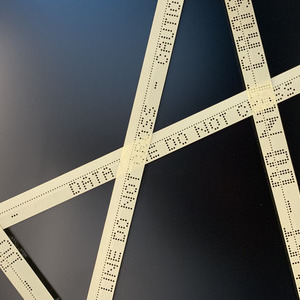
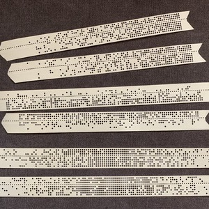
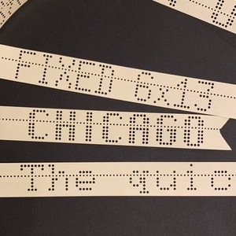
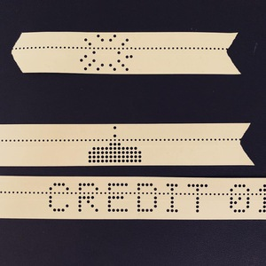
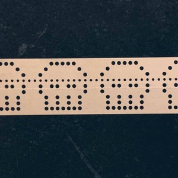
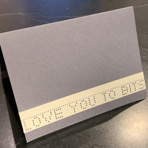
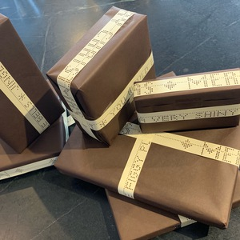
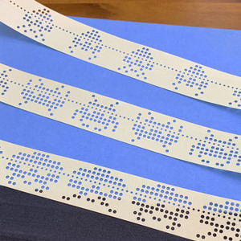
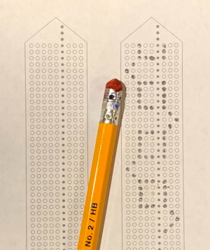

# Paper-Tape Patterns

This directory has a collection of "papertape pattern definition files".  You can use them to punch 8-level tape with bubbles, diamonds, grids, hearts, space invaders, Gray sequences, skulls, text in multiple fonts, and whatever else you can imagine.

The results are fun.

[](../../pix/tape_donotcross.jpg)
[](../../pix/tape_fade.jpg)
[](../../pix/tape_fonts.jpg)
[](../../pix/tape_invaders.jpg)
[](../../pix/tape_invaders2.jpg)
[](../../pix/tape_skulls.jpg)
[](../../pix/tape_valentine.jpg)
[](../../pix/tape_xmas.jpg)
[](../../pix/tape_book1.jpg)
[](../../pix/tape_book2.jpg)

### Generating the patterns

[This Python script](https://github.com/hughpyle/ASR33/blob/master/bin/pattern) reads a pattern-file and converts it to the binary message that punches the pattern on tape.
You may need to `pip install pillow click` before you can run it.

```bash
$ ./pattern --help
Usage: pattern [OPTIONS] PATTERN [WORDS]...

  Print patterns to punchtape.

Options:
  --font PATH  Font: 6x13, 6x13B, 6x13O, 7x13, 7x13B, 7x13O, cga, cgathin,
               chicago, cl, helv, lur12, lur8, mod3270, mod6x13, nex6x10,
               small, smallcaps, vt100
  --part TEXT  Write only one named part of a pattern-file
  --all        Write all the available parts in a pattern-file (slow!)
  --test       Write text preview, not binary
  --list       List the available patterns
  --help       Show this message and exit.
```

For example, this prints out the pattern in a readable form on your terminal:
```
./pattern invaders --test
```

If you have a tape punch on `/dev/tty` you can run without "--test" to punch it:
```
./pattern invaders > /dev/tty
```

also try (for example)
```
pattern text --font vt100 "Tape is fun!" --test
```

### Tape on paper

To sketch out your own designs, send [this postScript file](template.ps) to your printer.

[](../../pix/tape_template.jpg)

Next-level: follow [ef1j95](https://twitter.com/ef1j95) on twitter.