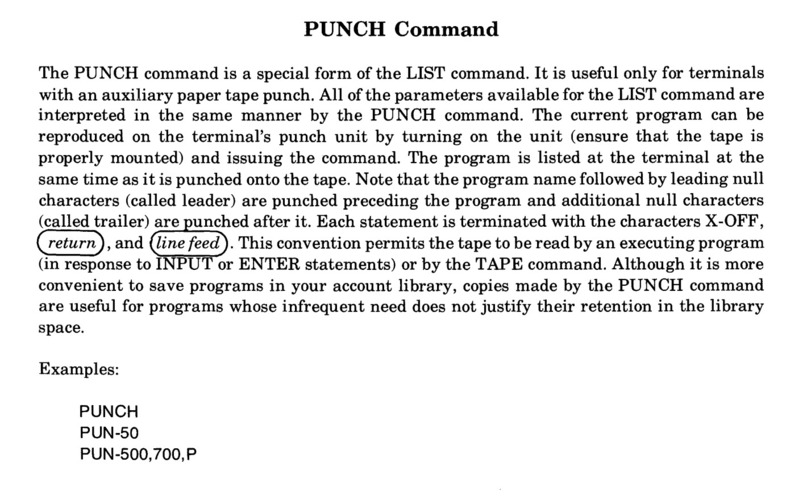

# What is a Teletype terminal?

The Teletype Model 33 is an electromechanical computer terminal, with a serial current-loop interface.

#### Terminal
A terminal consists of __data input__ and __data display__, connected to a computer system.   The teletype has a keyboard for input, and a printer for display.  The printer prints 72 characters per line on continuous-roll paper, and includes a bell (so that a typist can tell when nearing the end of a line, but also for notification).

_oops, no word-wrap_

#### Paper Tape
In the "ASR" (Automatic Send-Receive) Teletype models there are two additional I/O devices: a paper-tape reader for input, and a paper-tape punch (reperforator) for output.  [Punched paper tape](https://en.wikipedia.org/wiki/Punched_tape) is a great way to store and communicate data, although it's limited in density (10 characters per inch, or 2.66 kilometers per megabyte), slow (the Teletype can read/write at 10 bytes per second, 29 hours per megabyte), and tears quite easily.

Tape helps you prepare a machine-readable copy of your program or data offline for upload later, saving on phone bills and computer time, as you can see in this [wonderful YouTube video](https://www.youtube.com/watch?v=W4gwJAO2EWg).  And here's what the [HP2000/ACCESS BASIC manual](http://bitsavers.trailing-edge.com/pdf/hp/2000TSB/22687-90001_AccessBasic9-75.pdf) has to say: use tape to store your programs if you don't need them very often:

The reader is mechanical, which is pretty cool.  I don't understand it yet.

_8-level paper tape (here showing ASCII with no parity, so the 8th bit is unset)_

#### ASCII
The keyboard and printer use ASCII, which is a 7-bit character encoding [standardized in 1963](http://citeseerx.ist.psu.edu/viewdoc/download?doi=10.1.1.96.678&rep=rep1&type=pdf), with numbers, upper-case letters (no lowercase!), punctuation, and several _control characters_.  (Some of the punctuation is [unusual](https://twitter.com/33asr/status/1052956789086531584)).

An eighth data bit can be used for [parity](https://en.wikipedia.org/wiki/Parity_bit), depending on the exact model of Teletype keyboard.

The tape punch and reader use all 8 bits, so can be used to read and store binary data (bytes). 

 

_Pretty typewheel, and comprehensive man pages (in the three-ring binder)_

#### Serial Data Mechanism
The data connection is a serial [current loop](https://en.wikipedia.org/wiki/Digital_current_loop_interface).  There are two independent current loops, one for "send" and another for "receive".  They are quite reliable over moderate distances (up to several kilometers), which is handy when your nearest computer is a long way away.

On the "send" (keyboard and tape reader), the teletype doesn't have any electronics!  The 8-bit parallel connections go to a [distributor](https://www.youtube.com/watch?v=E0T1zj1MuPc) with a rotating brush (driven by a motor and clutch) that make or break the current loop for each bit in turn.  It's quite complicated and completely mechanical, but well-documented.  The keyboard "latches", when a key is pressed it stays down (making the wires [connect for each bit](https://www.youtube.com/watch?v=HtnFg0m41zk)), until the distributor has rotated to send the bits down the wire.  Then the next key can be pressed, and then latched until sent, and so on.

On the "receive" side (printer and tape punch), the serial current loop is distributed to a set of solenoids that lift [codebars](https://www.youtube.com/watch?v=d-VPz2ZT0CQ) to move the print head and punch pins.  There's some electronics here: a simple solid-state amplifier from the 20mA loop to 500mA to drive the solenoids.  Again, the mechanics are quite complicated, with the print head rotating for each incoming character, and also the carriage moving forward, and the "CR" code (carriage return) triggering the release of the spring that returns it.  Oil is required, and accounts for the vintage smell.  Its [vintage sound](https://www.youtube.com/watch?v=AVMpcS4BUoY) is quite something, too.

PCs generally used the [RS-232](https://en.wikipedia.org/wiki/RS-232) serial interface standard, which is based on voltage rather than current.  But this has itself been superseded by [USB](https://www.electronics-notes.com/articles/connectivity/usb-universal-serial-bus/standards.php).

The Model 33's data format – 1 start bit, 8 data bits and 2 stop bits – is simple, but obsolete.  By USB standards, a teletype is ridiculously slow; very few hardware interfaces (UARTs) can be found nowadays that will connect at the blazing speed of 10 characters per second (110 bits per second).  They're all in the megabit, gigabit, whatever.  But my speed is slow enough to simulate, even if the hardware has left us behind.

