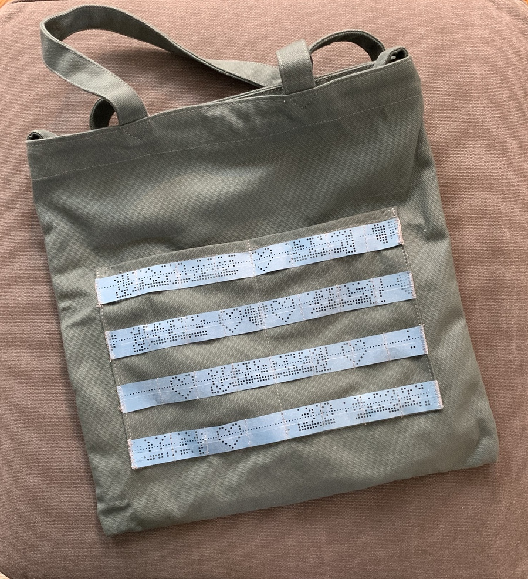
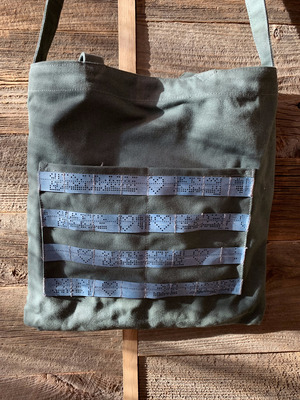
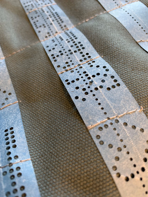
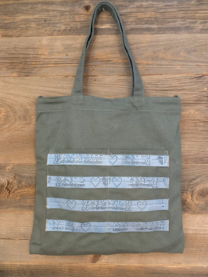

# Mylar Punch-Tape Tote

Mylar is much more robust than paper.  Historically it was used for punchtapes that needed to be used many times, such as boot loaders, other heavily used programs and data.  This is ideal where a CNC is controlled by instructions on a roll of tape, for example.

Unlike paper, mylar really doesn't tear easily.  It cuts cleanly, folds crisply and crushes a little bit, but it'll survive.

So, I wondered, does it sew?

Yes, it does.  It sews really easily.

### Punching Mylar

It turns out that the Teletype is not really strong enough to punch Mylar tape.  It will punch most holes, but fails on all-on bits, and sometimes has problems with reliable feed.

So, I won't be doing it again soon.

Maybe a [Model 35](http://www.navy-radio.com/manuals/tty/35-brochure-1966.pdf) – the heavy-duty 8-bit Teletype machine – or a [HP punch](http://www.hpmuseum.net/display_item.php?hw=282) or FACIT or other high-performance model would work. 

### Sewing MOLLE

This is a one-off gift project, styled with a finger pointing at the [tacticool](https://taskandpurpose.com/theres-something-molle-guide-making-civilian-life-tacticool) thing that seems to be everywhere (the dimensions are right!), but instead data-driven with lovingly crafted UTF8, and some 8-bit heart shapes.  Because when you need a bug-out bag, friends and family will be important.

