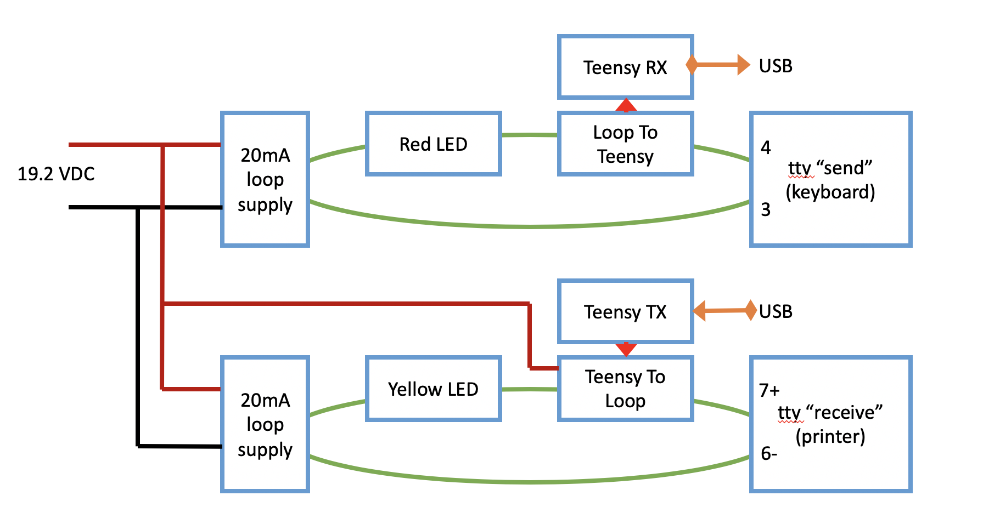

# Interface Hardware

I built a current-loop to USB interface from scratch, powered by a Teensy
microcontroller.  It's a hobbyist build, not intended to be commercially
replicable.  A very cool way to learn about current-loop interfaces 
nevertheless.

Project notes and pictures: [PDF](./tty-usb.pdf) and [PowerPoint](tty-usb.pptx).

The key features are:

* 20mA current loop @ 110 baud, interface to USB Serial.  The USB stuff is done with a Teensy microcontroller.
* Duplex operation, with separate transmit and receive loops.
* The loops are active (integrated current source), since the ASR33 is passive.
* Monitor loop activity with LEDs.
* Some character translation and processing is done in [Teensy firmware](../firmware/).

Additional information:

* [SPICE diagrams](./ltspice/) for the current-loop interface.
* [Older pictures](./v1_2015) from a discarded first build.

